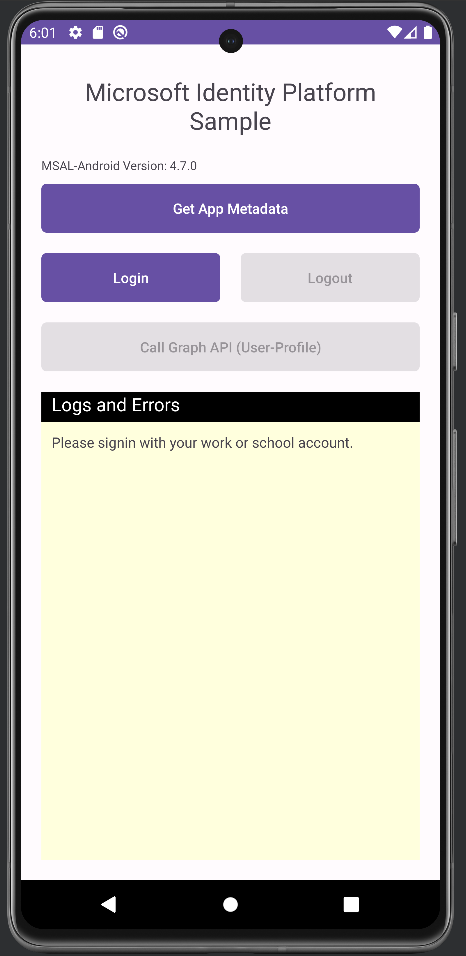

# Kotlin | mobile app | user sign-in, calling Microsoft Graph API | Microsoft identity platform

This sample demonstrates an Android application written in Kotlin that is both protected by Microsoft identity platform and accesses Microsoft Graph as the user by using the Microsoft Authentication Library (MSAL).

The sample uses MSAL-Android version 4.7.0 and the `signIn()` and the `acquireTokenSilentAsync()` methods have been updated as per the last MSAL-Android version implementation.

## Prerequisites
- Azure Active Directory (Azure AD) tenant and the permissions or role required for managing app registrations in the tenant.
- Kotlin 1.8.0
- Android Studio (Android Studio Giraffe | 2022.3.1) and an emulator (Android 10+)

# Setup

### 1: Register your application. 
Use the following settings for your app registration:

| App registration   setting | Value for this sample app                                                    | Notes                                                                                              |
|:------------------------------:|:-----------------------------------------------------------------------------|:---------------------------------------------------------------------------------------------------|
| **Name**                       | `MsalAndroidApp1`                                                                  | Suggested value for this sample.   You can change the app name at any time.                    |
| **Supported account types**    | **Accounts in this organizational directory only (Single tenant)**           | Suggested value for this sample.                                                                   |
| **Platform type**              | **Android**                                                                  | Required value for this sample.   Enables the required and optional settings for the app type. |
| **Configure your Android app** | **Package Name**: `com.example.msalandroidapp1` **Signature Hash**: _Use value from the app_  **Redirect URI**: _Use value from the app_                                                      | Package name is required for this sample, other values are optional and can be changed at any time.  Record these values for use in Android application.                                                                    |

### 3. Run the application

In Android Studio, press `Shift` + `F10` or select _Run 'app'_ from the navigation menu.

If everything worked, the sample app should produce output similar to this:

## About the code

This sample demonstrates how to obtain a token and make a call to the Graph API in Single Account Mode.  The MSAL library (MSAL-Android v4.7.0) is used to request authentication via a SingleAccountPublicClientApplication.  Once the user is authenticated, an HTTP request to Graph is issued by way of Volley.  The results of the call to Graph are displayed in the application.

Reference Article: https://github.com/skabou/ms-identity-docs-code-java/tree/android-kotlin